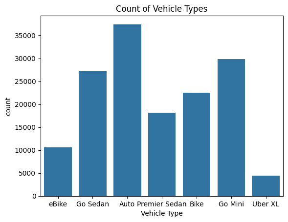
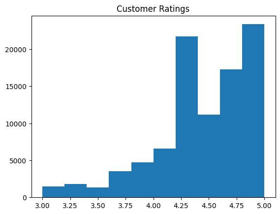
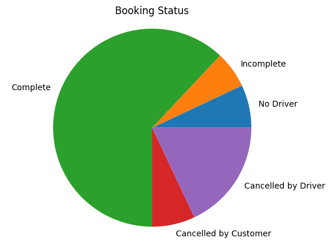
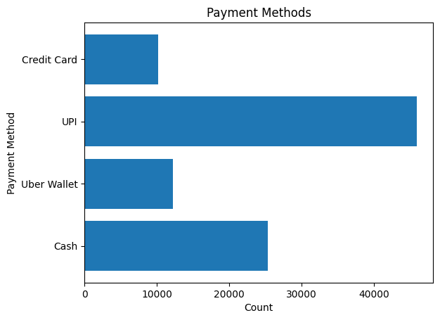
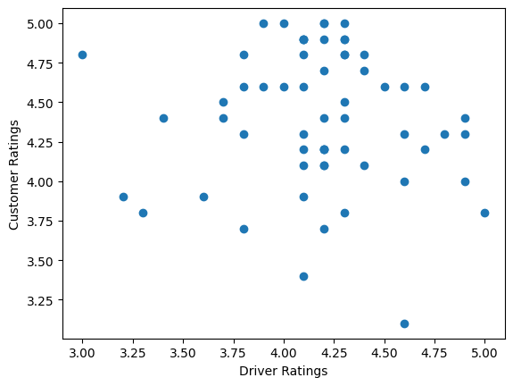
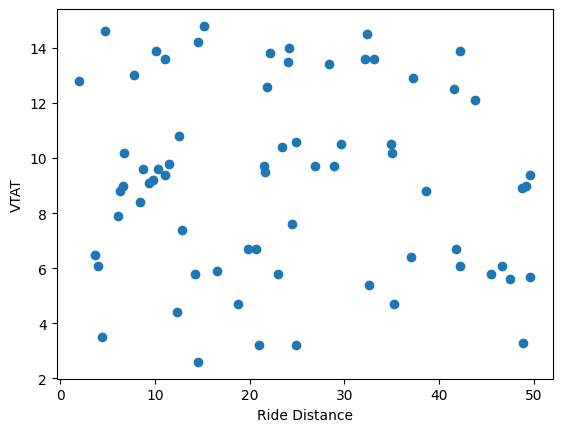
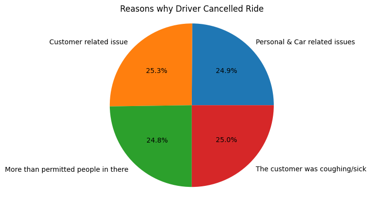
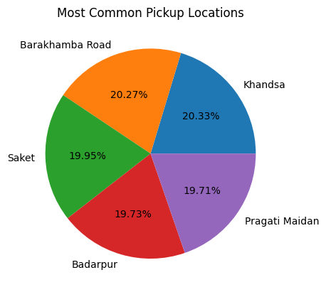
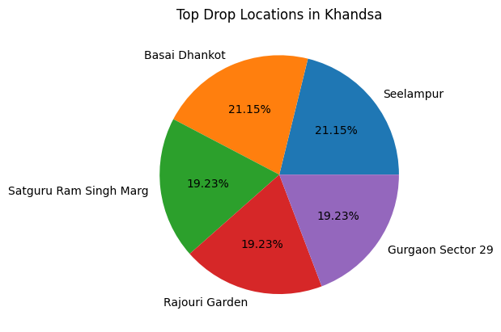
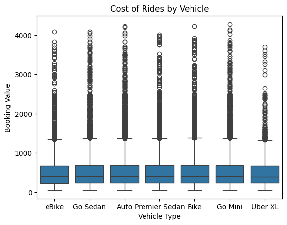

## Repository name
Your repostiory should be named something like `async-final-project-color-name`
Example: `async-final-project-teal-Anas`

## Dataset
[Dataset Name](https://www.kaggle.com/datasets/yashdevladdha/uber-ride-analytics-dashboard)

## Why did I chose this dataset?

I chose this data set because I want to analyze uber rides more. I want to see what are the chances of a customer canceling a ride and the main reasons why the ride was canceled. I also want to see what the average distance of a ride is. 

## Progress
- [ ] Picked dataset
- [ ] Defined 10 questions
- [ ] Answered 10 questions using Pandas
- [ ] Added at least one data visualization (using Matplotlib and/or Seaborn) to each single question
- [ ] Prepared presentation slides to present at graduation

## Questions
- [ ] Question 1: What are the vehicle types used?
  - Answer: There is a total of 7 vechicles that uber uses: eBike, Go Sedan, Auto, Premier Sedan, Bike, Go Mini, and Uber XL. 
  - Visualization: 

- [ ] Question 2: What are the customer ratings?
  - Answer: Majority of the ratings are between 4.25 and 5.00
  - Visualization: 

- [ ] Question 3: What is the booking status like?
  - Answer: Most rides are completed, but there are a lot of rides that are cancelled by the driver.
  - Visualization: 

- [ ] Question 4: How do most people pay for their rides?
  - Answer: UPI, cash, uber wallet, credit card
  - Visualization: 

- [ ] Question 5: Is there a relation in customer ratings and driver ratings?
  - Answer: Yes, higher driver ratings tend to also have higher customer ratings based on a random sample of 100. 
  - Visualization: 

- [ ] Question 6: Is there a trend with VTAT and ride distance?
  - Answer: There is no trend between these two. 
  - Visualization: 

- [ ] Question 7: What are the top reasons driver cancels rides?
  - Answer: Drivers cancel rides mainly because of customer issues. There is only 24.9% of personal and car related issues. 
  - Visualization: 

- [ ] Question 8: What are the top 5 pickup locations?
  - Answer: Khandsa is the most common pickup location. 
  - Visualization: 

- [ ] Question 9: What are the most common drop off location in Khandsa?
  - Answer: Seelampur, Basai Dhankot, Satguru Ram Singh Marg, Rajouri Garden, Gurgaon Sector 29         
  - Visualization: 

- [ ] Question 10: What do the booking value look like for each vehicle type?
  - Answer: Auto and Go Mini are the most high cost rides. 
  - Visualization: 
